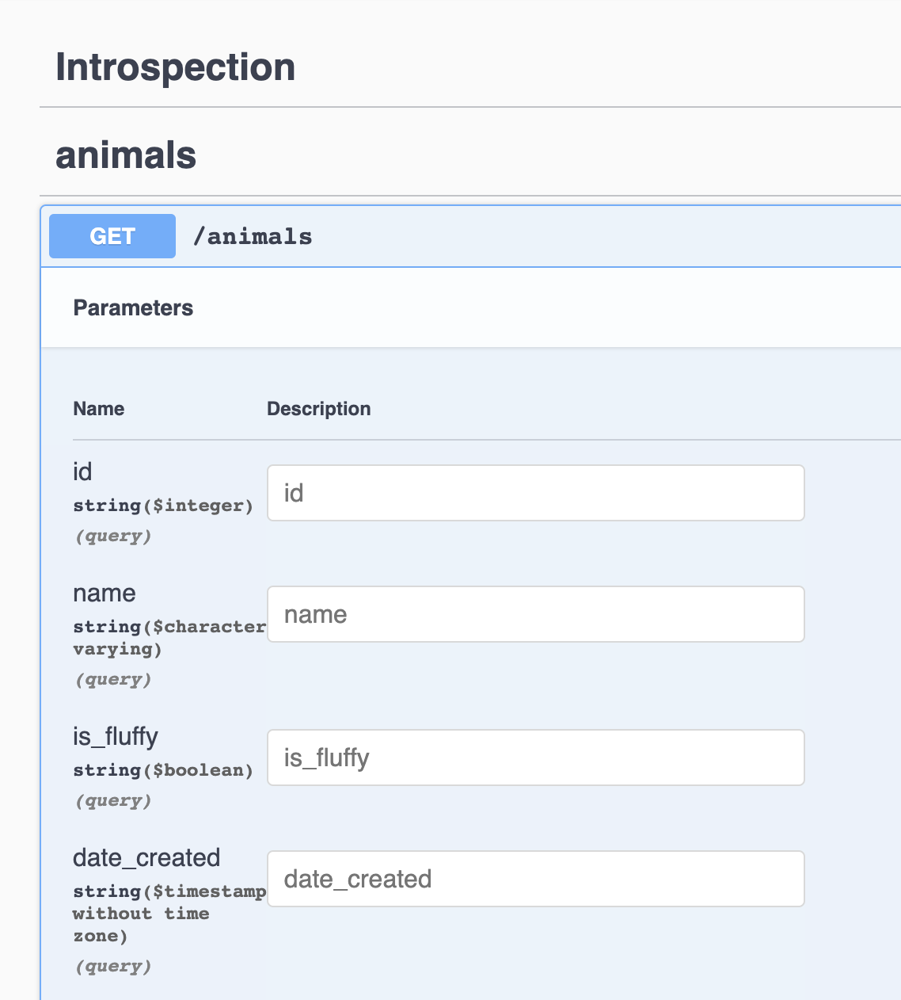
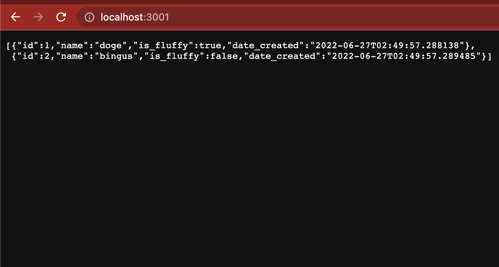

# PostgREST + Spin = `SELECT "<3";`

Right now there are limitations in the host component architecture that block
support for relational databases. The WASI Sockets proposal is also a long way
away. This is project is to mitigate those issues for now and offer an
alternative: Use Postgres over an HTTP interface

Simply make a request to the table (model) you wish to view:

```rust
send_request(
	http::Request::builder()
		.method("GET")
		.uri("http://localhost:3000/animals")
		.body(None)
		.expect("Sitemap: Request build error."),
)
```

How does it know to expose this table as an API?



PostgREST introspects your database and exposes an HTTP REST API based on what
is already in your database. There are alternatives to this approach as well
like Postgraphile and Hasura. I'm a big Hasura fan because it's easy to set up,
but if GraphQL is out of your scope, REST should be familiar.



## Running Locally

1. Get docker installed and ready
1. From the root of this directory: `docker-compose up -d`
1. `spin build && spin up`
1. Visit https://localhost:3001
